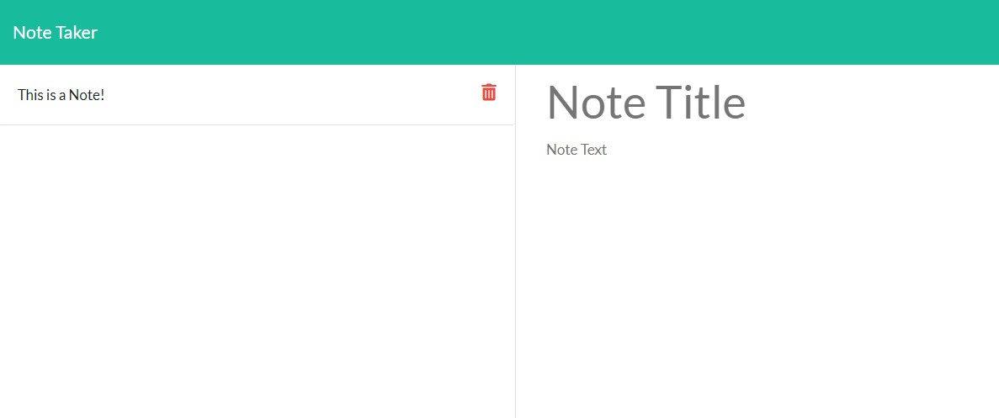

# Note Taker



## Description

This was a project I completed to learn Express.js for my Berkeley Bootcamp. I created a server to run Note Taker: An application that allows
the user to create, save, update, and delete notes on their browser.

## User Story

```md
AS A small business owner
I WANT to be able to write and save notes
SO THAT I can organize my thoughts and keep track of tasks I need to complete
```

## Technologies Learnt/used

Express, API routes (GET, POST, DELETE)
